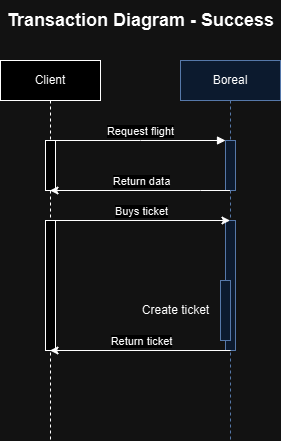
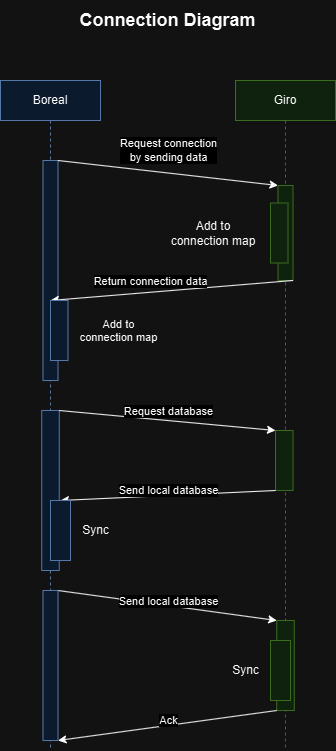
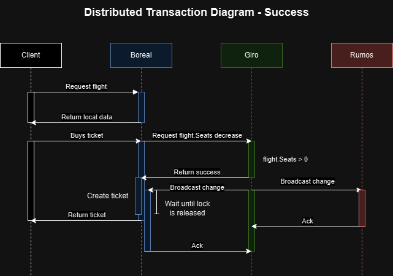
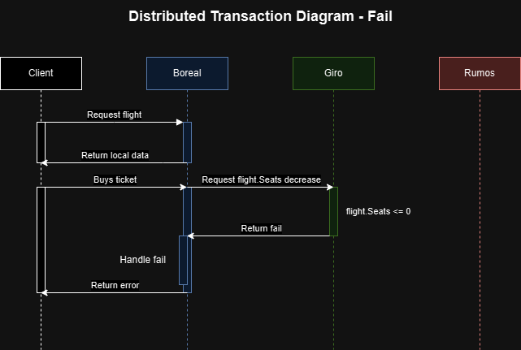

# PassCom - Sistema distribuído de venda de passagens aéreas

## Introdução

O advento do comércio digital (também chamado de "E-commerce") se propagou de maneira exponencial no último século. Isso ocorreu principalmente nos últimos anos, devido a variáveis como o período pandêmico, que forçou a digitalização do comércio. As plataformas digitais fornecem qualidade de serviço, atendimento prático, rápido e automatizado, proporcionando melhor experiência aos clientes.

O presente relatório visa descrever o desenvolvimento do sistema "PassCom", um sistema de venda de passagens distribuído para três companhias aéreas (Rumos, Giro e Boreal). O software foi desenvolvido utilizando a arquitetura REST, com servidores HTTP individualizados codificados em Go, com acesso a banco de dados SQLite via uso da biblioteca GORM para mapeamento relacional de objetos. O front-end foi desenvolvido com o framework React. Também foi adicionada uma interface CLI acessível via TCP para monitoramento e configuração dos servidores. O sistema é conteinerizado com Docker, permitindo consistência no funcionamento.

O projeto atendeu os requisitos de forma satisfatória pela confecção de um projeto com arquitetura flexível e escalável que visa a praticidade do uso para os usuários.

### Equipe

[](https://github.com/pierremachado) [Pierre Machado](https://github.com/pierremachado)

[](https://github.com/valmirnogfilho) [Valmir Nogueira](https://github.com/valmirnogfilho)

## Arquitetura da solução

O servidor desenvolvido utilizou uma abordagem de arquitetura "stateless". Tanto as comunicações entre clientes das companhias e o servidor, quanto a comunicação entre servidores, consistem em um sistema de requisições e respostas.

A arquitetura consiste na transação de mensagens curtas, com solicitações pequenas para operações nos servidores. A escolha adotada traz mais escalabilidade, além de portabilidade para mais dispositivos acessarem os servidores em simultâneo.

Entretanto, embora o paradigma seja stateless, que prevê a ausência de estados, são armazenadas informações temporárias de sessão dos usuários. A abordagem transmite um ID de "token" da sessão, para garantir segurança em acessos e permissões privadas para os usuários do sistema, além de criar funcionalidades personalizadas, como carrinho de compras temporário para os usuários.
Stateless. Os servidores foram projetados para operar de forma independente e escalável. A conexão entre os servidores é feita utilizando um cliente TCP, e, assim que os servidores se conectam, o sistema verifica periodicamente o status da conexão através de heartbeats.

De forma independente, o diagrama de sequência do sistema mostra a comunicação entre o cliente e o servidor. Nessa perspectiva, é possível visualizar o sistema distribuído como se fosse apenas um servidor centralizado.

**Especifique as APIs de comunicação implementadas entre os componentes desenvolvidos, descrevendo os métodos remotos, parametros e retornos empregados para permitir a compra de passagens entre clientes e servidores, e entre servidores.**

A equipe foi orientada a implementar o protocolo de comunicação HTTP, que acarretou na decisão do paradigma stateless. O protocolo HTTP é feito em cima do paradigma stateless, além de ser construido em cima do protocolo TCP, que assegura a entrega de informações na conexão.



Quando o servidor de duas companhias estão conectados, eles trocam o banco de dados local entre si, tornando-se réplicas de si mesmo. Essa conexão é exemplificada pelo diagrama de sequência a seguir.

A decisão adotada para o projeto faz com que cada servidor da PassCom possua, além de seus dados, uma réplica do banco de dados dos outros servidores. Os algoritmos de consenso e roteamento permitem a sincronização das compras de forma segura. Quaisquer operações sobre as passagens dos vôos fazem com que todas as réplicas sejam alteradas, independente das operações serem locais ou referentes aos outros servidores.

Tendo em vista que todos esses dados são compartilhados, se torna mais prático fazer algoritmos de grafos sobre os dados para formular as rotas, visto que a tabela de vôos forma um supergrafo das três companhias. A decisão de adicionar uma permanência de dados a partir de um banco de dados relacional auxiliou na associatividade dos vôos, a partir da relação entre aeroportos de origem e destino. 

Como trata-se de um protótipo, foi utilizado um banco de dados SQLite, que é mais simples e possui os mesmos princípios SQL de bancos mais complexos. O acesso aos dados a partir do padrão Data Access Object (DAO) de forma centralizada permite a mudança para um banco de dados mais escalável e seguro com poucas mudanças nas configurações de drivers. Além permitir acesso aos dados do banco pelos models do projeto, a biblioteca GORM abstrai o acesso a banco de dados relacionais, tornando essa adaptação ainda mais simples.

Um algoritmo de Bread-First-Search forma o caminho mais curto a partir das rotas distribuídas. Essas informações são expostas na interface gráfica a partir das passagens individualmente compráveis e do mapa, que ilustra o caminho das rotas, com as cores das rotas simbolizando as cores temáticas das três companhias. As passagens também expoem as logomarcas de suas respectivas companhias.


A sincronização de dados é feita através de broadcast do voo quando é editado em seu servidor de origem.

Para implementar o sistema PassCom, o projeto foi feito em Go e a interface gráfica em React.

Para assegurar a consistência dos dados distribuídos de maneira descentralizada, foi utilizado o "gossip protocol". Trata-se de um algoritmo de consenso peer-to-peer para sistemas distribuídos focado em manter o estado do seus nós (no caso, os servidores).

A lógica do protocolo consiste no envio periódico em \"broadcast" dos dados de compra e cancelamento de vôos para as três companhias, independentemente da operação ser relacionada ao servidor local ou aos servidores remotos. Isso garante a estabilidade e consistência de todas réplicas do banco de dados, de maneira descentralizada, evitando que a existência de um servidor central que possa se desconectar atrapalhe o sistema como um todo.
O sistema distribuído foi projetado tendo em mente as seguintes assunções:

- Assume-se que qualquer um dos nós pode falhar a qualquer momento de forma permanente (por falha de hardware, desligamento), ou que a latência entre os servidores impediria a comunicação devida. O sistema se reorganizaria para continuar funcionando sem o nó ausente.
- Tempo parcialmente-síncrono: o sistema assume que a comunicação entre os servidores é rápida e não há latência significativa. Entretanto, pode ocorrer que as mensagens cheguem de forma atrasada.
- Teorema CAP (CAP Theorem): teorema fundamental de sistemas distribuídos que dita que estes não podem garantir a consistência, disponibilidade e a partição de rede do sistema simultaneamente. Logo, a disponibilidade foi sacrificada - se um dos nós falharem, mesmo que os outros servidores continuem funcionando normalmente e tenha os dados deste servidor, a venda não será efetuada por nenhum nó.

## Protocolo de comunicação

A solução da equipe aplicou o conceito de "heartbeat" e relógios vetoriais na comunicação entre os servidores, para asssegurar a confiabilidade dos dados após a possível desconexão de um dos servidores. 

O "heartbeat" trata-se de um algoritmo que envia mensagens periódicas para os servidores, a fim de apenas checar se estão ativos. Caso contrário, o servidor desconectado é desconsiderado para operações de consultas, até que possa talvez se reconectar novamente. Para isso, o heartbeat persiste lhe mandando sinais, a espera de um possível retorno. A proposta de algoritmo não causa grande peso nos servidores, por mandar mensagens leves e em um período de tempo razoável.

 Os relógios vetoriais armazenam três contadores de processos relativos aos  respectivos três servidores. Após um processo de um servidor, seu contador é incrementado em cada cópia do relógio de cada servidor. O incremento dos contadores após cada processo assegura que o sistema saiba a ordem causal dos eventos, a partir da visualização das cópias e a ordem que seus contadores são incrementados.

Assim, se um servidor se desconecta por um período e se reconecta posteriormente, pode recuperar os dados perdidos após descobrir que seus contadores estão reduzidos em relação aos demais relógios. Após a desconexão de qualquer um dos servidores, seu relógio vetorial é serializado e armazenado no seu arquivo `systemvars.json`, na sua pasta root, além de outros dados importantes para a sincronização, como registros de conexões, seus horários, endereços de server, logs e informações de identificação do próprio server.
HTTP. Os servidores das companhias possuem endpoints que utilizam para se conectar e conectar com os seus clientes. São eles:

(tabela com endpoints)

Através de solicitações get, post, put e delete, são capazes de organizar a compra de passagens entre clientes e servidores.

Cada um dos servidores possui uma pasta `test`, com testes de sincronização entre servidores, a partir da consulta dos relógios vetoriais. Os testes funcionam plenamente, demonstrando a confiabilidade das abordagens adotadas, inclusive em possíveis desconexões de partes do sistema.
O diagrama de sequência a seguir mostra o fluxo de comunicação entre os servidores quando o cliente deseja comprar uma passagem.



As funções e métodos do projeto relativas a lógica de negócios, endpoints da API e componentes da lógica interna de comunicação distribuída estão documentadas, permitindo melhor visualização dos parâmetros a serem passados e o retorno das operações.
## Roteamento

Como cada servidor mantém uma réplica do banco de dados do outro quando eles se conectam, é possível determinar rotas entre os trechos dos servidores das companhias que estão conectados.

O algoritmo realiza uma BFS entre rotas e retorna uma rota contendo as rotas possíveis entre os trechos dos servidores das companhias que estão conectados.

## Concorrência Distribuída

Quando um voo é editado, todos os servidores das companhias que estão conectados com os outros servidores do sistema notificam aos nós conectados essa alteração através de um broadcast; essa operação é idempotente, pois o servidor não pede para decrementar em um a quantidade de assentos, e sim envia o estado atual do voo e pede para os nós conectados substituirem as informações atuais. Portanto, se a mensagem chegar múltiplas vezes, será alterado apenas uma vez.

Além disso, o servidor não permite a venda da passagem de outro servidor que esteja offline, pois parte do pressuposto que não é possível determinar se o problema está localizado na rede ou se o servidor caiu.

Algoritmos de consenso que possuem como alicerce a eleição de nós lideres, como Paxos e Raft, foram cogitados para o projeto. Todavia, a implementação destes foi descartada. Se deve ao fato de que algoritmos de consenso dessa forma impediria que os servidores pudessem operar de forma independente assim que não fosse possível se conectar a um quorum de servidores operando e recebendo mensagens.



Portanto, o sistema permite que as informações sobre os vôos de outras companhias, como a quantidade de assentos disponíveis, estejam desatualizadas eventualmente caso a mensagem de broadcast não chegue ao servidor destinatário. Entretanto, nenhum servidor pode vender a passagem de um servidor que esteja offline.

Para tratar a eventual concorrência de dois clientes tentando comprar o mesmo assento, o sistema implementa locks otimistas. O lock acontece apenas no momento da transação ou no envio de uma mensagem, e, caso resulte em erro, a transação é cancelada e o cliente é notificado.

## Confiabilidade da solução

No momento atual, o sistema PassCom possui algumas vulnerabilidades. Atualmente, não há um algoritmo de consenso confiável implementado para o sistema. Isso faz com que, caso as informações cheguem de forma inconsistente, os dados dos outros servidores podem aparecer desatualizados para o cliente: um assento de outro servidor pode estar marcado como disponível para um cliente local, mas os assentos do outro servidor podem estar marcados como indisponíveis para o cliente do servidor em questão. Em ambos os casos, a transação resultará em um erro. 

Além disso, se um dos servidores falhe durante uma transação, é possível que a quantidade de assentos disponíveis seja decrementada, mas o servidor remetente não receba a mensagem de confirmação da transação. Para resolver esse problema, um algoritmo de consenso confiável ou de transações distribuídas, como Two-Phase Commit (2PC), poderia ser implementado para garantir a confiabilidade da solução. Por fim, cada servidor dispõe de relógios vetoriais para determinar a causalidade e ordem dos eventos, mas não os utilizam.

## Avaliação da Solução

O código foi mantido no GitHub para o seu desenvolvimento e testado através da interface gráfica do projeto.

## Documentação do código

O código possui a documentação dos endpoints HTTP que ditam a comunicação do servidor com o cliente.

## Emprego do Docker

O sistema completo foi conteinerizado via uso do Docker. Cada um dos servidores separados possui um Dockerfile, com instruções de diretórios a serem copiados, portas a serem expostas e volumes de persistência de dados a serem considerados (arquivos JSON e os arquivos de database SQLite). Também foram criados contêineres para execução das interfaces React, e a comunicação entre front-end e back-end pelas APIs foram asseguradas pelas networks criadas. Os Dockerfiles dos servidores também expõem as portas para acesso ao server CLI de monitoramento dos servidores REST.

Assim, o arquivo `docker-compose.yaml` une a execução dos contêineres, permitindo o build e execução dos componentes de cada uma das companhias aéreas a partir do comando:

```
docker compose up --build
```


## Conclusão

A equipe produziu uma solução confiável, robusta, e de apresentação moderna e intuitiva para usuários leigos com interesse na compra de passagens aéreas. A arquitetura organizacional do projeto foi produzida visando separar bem funções em arquivos e diretórios com propósitos em comum, de acordo com o Single Responsability Principle. Além disso, atribuiu os padrões MVC para dividir diretórios relativos a dados, lógica de negócios e exibição, e DAO para centralizar localmente o acesso ao banco de dados, tornando o consumo de dados fácilmente reconfigurável e evitando repetição inconsistente de locais.

Além disso, a escolha mais robusta dos algoritmos de consenso priorizam a consistência das informações, acima da decisão de economia de espaço de armazenamento, visto que cada servidor possui réplicas dos dados dos outros.

Conclui-se que o sistema PassCom, apesar de possuir vulnerabilidades, é funcional e requeriu o estudo de uma série de técnicas de arquitetura, protocolo de comunicação, roteamento, concorrência distribuída e confiabilidade. Algumas melhorias podem ser feitas, como a implementação de algoritmos de consenso confiáveis e o reforço da robustez do sistema em caso de falhas, como, por exemplo, armazenar os logs das transações pendentes em disco.

Ademais, alguns tópicos podem ser revisitados futuramente, como:


 Espera-se que a implementação do sistema PassCom contribua positivamente para a compreensão e aperfeiçoamento dos sistemas distribuídos no futuro.
